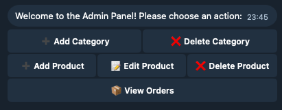

# ECOMBot - A Full-Featured E-commerce Telegram Bot


<p align="left">
  <!-- Python Version -->
  <a href="https://www.python.org">
    
  </a>
  <!-- Framework -->
  <a href="https://aiogram.dev/">
    
  </a>
  <!-- ORM -->
  <a href="https://www.sqlalchemy.org/">
    
  </a>
  <!-- Code Style: Black -->
  <a href="https://github.com/psf/black">
    
  </a>
  <!-- Linter: Ruff -->
  <a href="https://github.com/astral-sh/ruff">
      
  </a>
  <!-- Type Checked with MyPy -->
  <a href="http://mypy-lang.org/">
    
  </a>
  <!-- License -->
  <a href="./LICENSE">
    
  </a>
</p>

A showcase of a robust, asynchronous e-commerce bot built with Python, Aiogram 3, and SQLAlchemy 2.0. This project demonstrates a complete, end-to-end purchasing flow in a clean, service-oriented, and fully type-safe architecture.

---

## Features

### 👤 User Features
- **Product Catalog:** Browse through categories and view detailed product information.
- **Interactive Shopping Cart:** Add items, update quantities, or remove items from the cart.
- **User Profiles:** Users can manage their contact information (phone, email) and save multiple delivery addresses.
- **Smart Checkout:** A streamlined, multi-step checkout process that uses a "fast path" for returning users with saved details.
- **Order History:** View a list of past orders and check their status.
- **Status Notifications:** Receive proactive updates when an order's status changes (e.g., from "Processing" to "Shipped").

### 🔑 Admin Features
- **Full Product CRUD:** Admins can add, edit, and safely delete products through a conversational interface.
- **Full Category CRUD:** Admins can add, edit, and safely delete categories.
- **Order Management:** View orders filtered by status (Pending, Processing, etc.), see order details, and update the order status.
- **Stock Management:** Stock is atomically reserved during checkout and correctly restocked upon order cancellation.

---

## Technology Stack

- **Framework:** [Aiogram 3](https://github.com/aiogram/aiogram)
- **Database:** [PostgreSQL](https://www.postgresql.org/)
- **ORM:** [SQLAlchemy 2.0](https://www.sqlalchemy.org/) (with `asyncpg` driver)
- **Migrations:** [Alembic](https://alembic.sqlalchemy.org/)
- **Configuration:** [Pydantic Settings](https://docs.pydantic.dev/latest/usage/settings/)
- **Data Validation:** [Pydantic V2](https://docs.pydantic.dev/latest/)
- **Linting & Formatting:** [Ruff](https://beta.ruff.rs/docs/) & [Black](https://github.com/psf/black)
- **Type Checking:** [MyPy](http://mypy-lang.org/) (with `sqlalchemy-mypy-plugin`)
- **Testing:** [Pytest](https://docs.pytest.org/) (with `pytest-asyncio` and `pytest-mock`)
- **Logging:** [Loguru](https://github.com/Delgan/loguru)

---

## Project Setup

### Prerequisites
- Python 3.12+
- [Poetry](https://python-poetry.org/) for dependency management
- A running PostgreSQL database
- A Telegram Bot Token from [@BotFather](https://t.me/BotFather)

### Installation
1.  **Clone the repository:**
    ```bash
    git clone https://your-repo-url.git
    cd ecombot
    ```

2.  **Create and configure your environment variables:**
    -   Copy the example `.env.example` file to `.env`.
        ```bash
        cp .env.example .env
        ```
    -   Edit the `.env` file with your PostgreSQL connection details and your Telegram Bot Token.

3.  **Install dependencies using Poetry:**
    ```bash
    poetry install --with dev
    ```

4.  **Apply database migrations:**
    -   Ensure your `alembic.ini` is configured with the correct `sqlalchemy.url`.
    -   Run the upgrade command:
        ```bash
        poetry run alembic upgrade head
        ```

---

## Running the Bot
To start the bot, run the main application file from the project root:
```bash
poetry run python src/ecombot/main.py
```


    
## 🚀 Features & Workflow

This bot provides a complete, end-to-end e-commerce experience with distinct workflows for customers and administrators.

---

### 👤 Customer Workflow

The entire customer journey is designed to be seamless and conversational, from initial browsing to post-purchase support.

#### 1. 🛍️ Catalog Navigation (`/start`)
- Users are greeted with a list of top-level product categories.
- They can navigate into a category to view a list of all products within it.
- Selecting a product displays a detailed view with its description, price, and an "Add to Cart" button.

#### 2. 🛒 Shopping Cart Management (`/cart`)
- The cart is a persistent, interactive menu.
- **Add Items:** Users can add products to their cart directly from the product view.
- **Manage Quantities:** In the cart view, users can increase (`➕`), decrease (`➖`), or completely remove (`❌`) the quantity of each item.
- **Live Totals:** The cart view automatically updates the total price with every change.

#### 3. 👤 User Profile & Addresses (`/profile`)
- Users have a personal profile to manage their information.
- **Contact Details:** View and edit saved phone numbers and email addresses.
- **Address Book:** Add, view, and delete multiple delivery addresses (e.g., "Home", "Office").
- **Default Address:** Set one address as the default for a faster checkout experience.

#### 4. ✅ Smart Checkout (`✅ Checkout` button)
- The checkout process is intelligent and stateful.
- **Fast Path:** If a user has a complete profile (phone number and default address), they are presented with a one-click confirmation screen.
- **Guided Path:** If profile information is missing, the bot initiates a guided, multi-step conversation (FSM) to collect the necessary details (name, phone, address).
- **Saved for Later:** Information collected during a user's first checkout is automatically saved to their profile, enabling the "Fast Path" on all future purchases.

#### 5. 📦 Order History (`/orders`)
- Users can view a list of all their past orders.
- Each order displays its unique Order Number, status, date, and total price.
- Users can click a "View Details" button to see a full breakdown of the items purchased in any specific order.
- **Proactive Notifications:** The bot will automatically send a message to the user whenever their order status is updated by an administrator (e.g., from "Processing" to "Shipped").

---

### 🔑 Administrator Workflow

The admin panel provides powerful, protected tools to manage the entire store through a conversational interface.

#### 1. 🔐 Access Control (`/admin`)
- The admin panel is protected. Only users whose Telegram IDs are listed in the configuration can access these commands.

#### 2. 🗂️ Category Management
- Admins can **add** new product categories through a guided conversation.
- Admins can **edit** and **delete** existing categories.
- **Safety Check:** A category cannot be deleted if it still contains products, preventing orphaned data.

#### 3. 📱 Product Management
- Admins can **add** new products via a multi-step FSM that collects the name, description, price, stock, and assigns it to a category.
- Admins can **edit** any attribute of an existing product (name, price, stock, etc.) through a clear menu-driven interface.
- Admins can **delete** products with a confirmation step to prevent accidents.

#### 4. 📋 Order Fulfillment
- Admins can view a list of all orders, with the ability to **filter** by status (Pending, Processing, Shipped, etc.).
- They can view the full details of any order, including customer information and items purchased.
- **Status Updates:** Admins can update the status of an order through a simple button interface (e.g., "Mark as Shipped").
- **Stock Integrity:** When an order is **cancelled**, the stock for the items in that order is **atomically and safely returned** to the inventory.


    
### 🗄️ Database Schema

The application is built on a robust, normalized relational database schema designed for data integrity, performance, and scalability. The schema is managed by **SQLAlchemy 2.0** (ORM) and version-controlled with **Alembic** migrations.

#### Schema Diagram (ERD)

This diagram illustrates the relationships between the core entities of the e-commerce system.


## Database Schema Description

### Table Descriptions

#### Core User Management

*   **`users`**
    *   Stores the main profile for each unique user.
    *   It uses a surrogate primary key (`id`) for robust internal linking.
    *   Maintains a unique index on `telegram_id` to identify users from Telegram events.

*   **`delivery_addresses`**
    *   A user can have multiple saved addresses (e.g., "Home", "Office").
    *   The `is_default` flag allows for a faster checkout experience for returning customers.

#### Catalog Management

*   **`categories`**
    *   A self-referencing table that allows for a hierarchical structure (categories with sub-categories).

*   **`products`**
    *   The central table for all items available for sale.
    *   It is linked to a category.
    *   Includes database-level `CHECK` constraints to ensure stock can never be negative and price is always positive.

#### Shopping Cart

*   **`carts`**
    *   A simple table that represents a user's current shopping session.

*   **`cart_items`**
    *   A join table linking a cart to a product.
    *   It includes a `UniqueConstraint` on `(cart_id, product_id)` to ensure a product can only appear as one line item in the cart (adding it again just increases the quantity).

#### Order Processing

*   **`orders`**
    *   Represents a completed transaction.
    *   It uses a surrogate primary key (`id`) but also features a unique, human-readable `order_number` (e.g., `ECO-250925-ABCD`) that can be safely shown to the customer for tracking and support.

*   **`order_items`**
    *   A join table that creates a permanent record of an order's contents.
    *   **Crucial Design Choice:** This table captures the `price` of the product at the time of purchase. This ensures that even if the product's price changes in the `products` table later, the user's order history remains accurate.
    *   **Stock Management:** The creation of `order_items` is tied to the atomic reduction of stock in the `products` table within a single database transaction to prevent race conditions.


### 🏪 Stock Management & Reservation Strategy

This project implements a robust, industry-standard stock management strategy designed to prevent race conditions and ensure data integrity, especially during high-traffic checkout scenarios. The core principle is that a **shopping cart is a wishlist, not a reservation.**

#### The Business Logic Flow

1.  **Adding to Cart (Preliminary Check):**
    -   When a user adds an item to their cart, the system performs a simple, non-locking check to see if stock is available (`stock > 0`).
    -   This provides immediate feedback to the user if an item is already sold out, improving the user experience.
    -   **Crucially, this action does NOT reserve the stock.** The item is still available for other users to purchase. This prevents inventory from being "held hostage" by abandoned carts.

2.  **Checkout (The Atomic Reservation):**
    -   The real, definitive stock reservation happens only at the final moment of purchase, within a single, atomic database transaction.
    -   When the user confirms their order, the `order_service` initiates a transaction that does the following for *each item* in the cart:
        1.  **Pessimistic Locking:** The system executes a `SELECT ... FOR UPDATE` query on the product's row in the `products` table. This places a **database-level lock** on that specific row, preventing any other concurrent transaction from reading or writing to it until the current transaction is complete.
        2.  **Final Stock Check:** *After* acquiring the lock, the system performs the final, definitive stock check (`if product.stock < requested_quantity:`). Because the row is locked, this check is completely safe from race conditions. It is impossible for another user to buy the item in the split second between this check and the update.
        3.  **Stock Decrement:** If the check passes, the stock level is decremented (`product.stock -= quantity`).
        4.  **Order Item Creation:** An `order_item` record is created, permanently capturing the purchase.

3.  **Transaction Outcome:**
    -   **Success:** If all items in the cart pass their stock checks and are decremented successfully, the entire transaction is **committed**. The order is placed, and the stock changes are made permanent.
    -   **Failure:** If even a single item fails its stock check, the entire transaction is **rolled back**. The order is not created, and any stock decrements from previous items in the same cart are instantly reversed. This guarantees that the database always remains in a consistent state.

4.  **Releasing Stock (Order Cancellation):**
    -   The system correctly handles the full lifecycle of an order.
    -   If an administrator changes an order's status to `CANCELLED`, a reverse transaction is initiated.
    -   It uses the same pessimistic locking (`SELECT ... FOR UPDATE`) to safely **increase the stock** of each item from the cancelled order, returning the reserved inventory and making it available for purchase again.

This "lock-on-checkout" approach is a highly scalable and robust pattern that ensures the integrity of the inventory, prevents overselling, and provides a fair and consistent experience for all users.


#### SCREENSHOTS:

[]()
[]()

[]()
[]()

[]()
[]()

[]()
[]()

[]()
[]()

[]()
[]()

[]()
[]()

[]()
[]()

[]()
[]()

[]()
[]()

[]()
[]()

[]()
[]()

[]()
[]()

[]()
[]()

[]()
[]()
